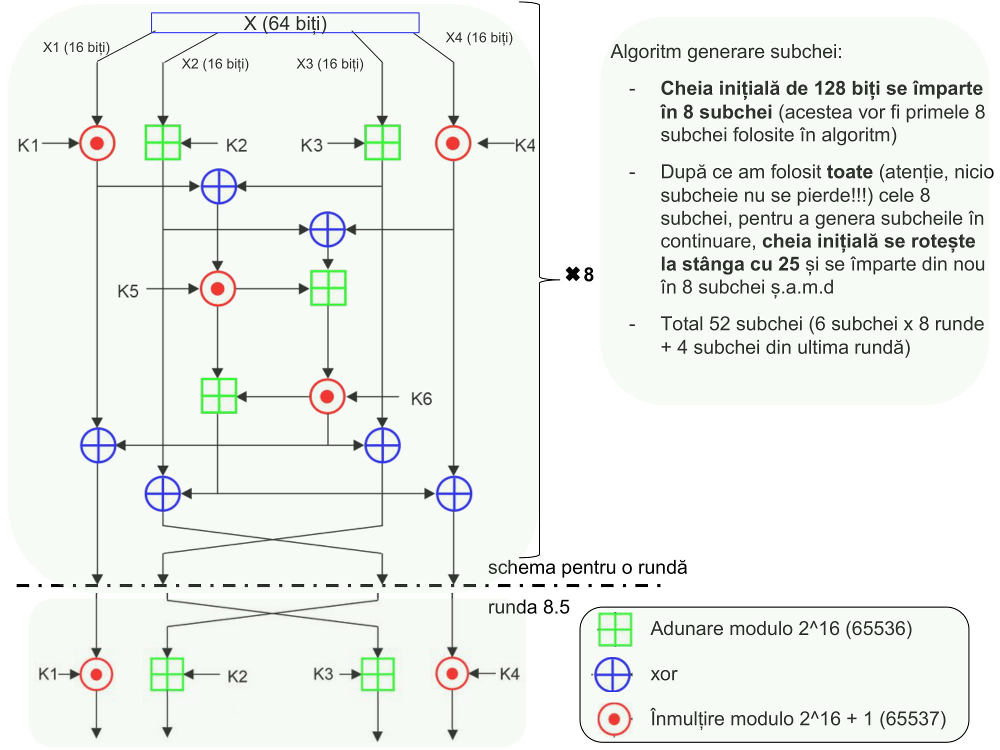

# Tema 1 :bulb:

1. Un exemplu cu o pereche de numere arbitrar alese care sa treaca pas cu pas prin algoritmul de adunare/scadere (inmultire pentru cei care au avut algoritmul de inmultire). Numerele se vor converti in format IEEE floating point single precision cu ajutorul unui IEEE calculator (de exp http://weitz.de/ieee/). Pentru ca algoritmul prezentat la CN1 sa ruleze corect trebuie ca numerele sa fie normalizate intr-un pas premergator introducerii numerelor in algoritm. Rezultatul va iesi normalizat din algoritm.

2. Implementarea in Verilog/VHDL a algoritmului de adunare/scadere (respectiv inmultire) in BA conform indrumarului de laborator si simularea logica a lui. Simularea se va face introducand 2 perechi arbitrare de numere la intrare. La iesire dupa timpul de amorsare necesar benzii de asamblare, la fiecare front pozitiv al ciclului de ceas va trebui sa apara cite un rezultat conform teoriei prezentata la curs.

# Tema 2 :bulb:
1. Implementarea funcției Fibonacci în varianta tradiționalăcu evidențiereanumărului de LUT-uri necesareimplementării
2. Implementarea funcției Fibonacci folosind Microblaze.

Cele 2 implementări vor  fi  testate  folosind placa de dezvoltare Nexys4 DDR aflată în dotarea laboratorului.

# Tema 3 :bulb:

Algoritm de criptare – IDEEA care este descries în cadrul îndrumarului de laborator.
Se va implementa encripție/decripția doar la nivel de simulare logică.
Se va implementa encriăția/decripția în C folosind microprocesorul Microblaze.

:beer:
